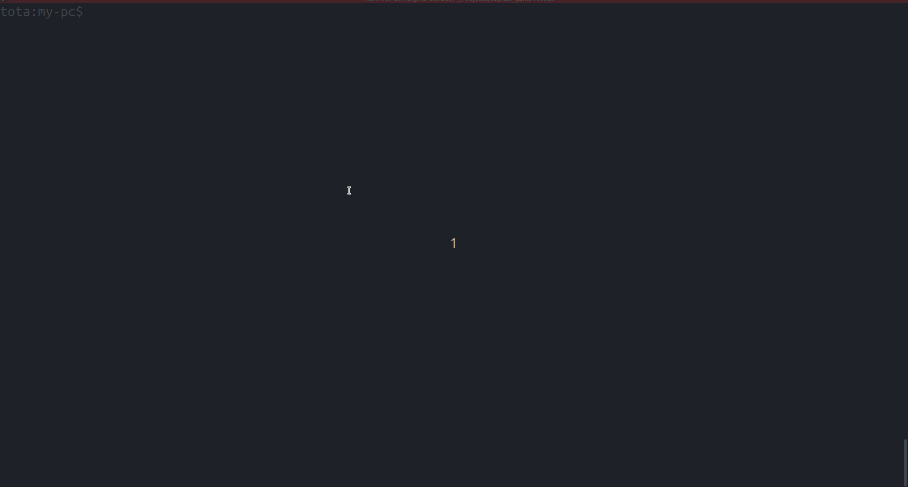

# Capital Gains

Recebe uma lista de transações e retorna o valor das taxas de cada transação.

## Dependências

Possuir o ruby instalado na versão 3.2.3 ou superior

```bash
ruby -v 
# ruby 3.2.3
```

## Como rodar o projeto

Rode o comando abaixo no seu terminal, e insira os inputs para calcular a taxa:

```
ruby cli.rb
```



**Dica:** Para finalizar o processo, basta apertar Enter sem nenhuma informação.


## Como rodar os testes

Rode o comando abaixo no seu terminal:

```
ruby tests/test_capital_gains_json.rb
```

## Coisas que gostaria de melhorar

- As classes Wallet e Transactions::CalculateTax ficaram com excesso de responsabilidade